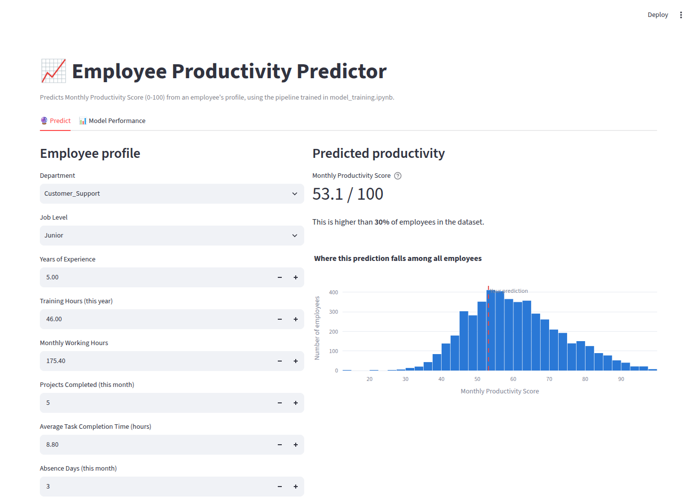
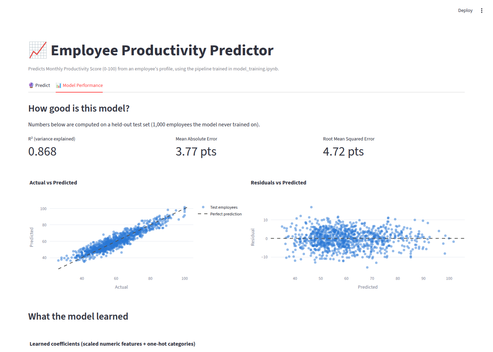

# Employee Productivity Predictor

## Business problem

HR wants a quick, explainable way to estimate an employee's **Monthly
Productivity Score (0-100)** from data they already track — department, job
level, experience, training, working hours, workload, absences, and
engagement survey results. A reliable, interpretable estimate lets managers:

- Flag employees whose predicted productivity is trending low early enough
  to intervene (extra training, workload rebalancing, engagement check-ins).
- See *which* factors move productivity the most, to prioritize HR programs
  (e.g. training budget vs. workload changes) by expected impact.

This project trains a linear regression pipeline on a synthetic-but-realistic
HR dataset and serves it through an interactive Streamlit web app.

## Files

| File | Purpose |
|---|---|
| `data.csv` | Dataset used for analysis and training (5,000 employees) |
| `model_training.ipynb` | EDA, linear regression assumption checks/fixes, pipeline training and evaluation |
| `model.pkl` | Saved final preprocessing + model pipeline (scikit-learn `Pipeline`) |
| `app.py` | Streamlit web app that loads `model.pkl` and serves predictions |
| `requirements.txt` | Python dependencies for both the notebook and the app |

## How to run

1. **Install dependencies** (Python 3.10+ recommended):

   ```bash
   pip install -r requirements.txt
   ```

2. **(Optional) Re-run the training notebook.** `model.pkl` is already
   included, so this step is only needed if you want to regenerate it
   (e.g. after changing `data.csv`):

   ```bash
   jupyter nbconvert --to notebook --execute --inplace model_training.ipynb
   ```

3. **Launch the web app:**

   ```bash
   streamlit run app.py
   ```

   This opens a browser tab (default `http://localhost:8501`) with two tabs:
   - **Predict** — enter an employee profile and get a live predicted score,
     with a chart showing where that prediction falls among all employees.
   - **Model Performance** — R², MAE, RMSE on held-out test data, an
     actual-vs-predicted scatter plot, a residuals plot, and the model's
     learned coefficients (which features push the score up or down).

## Screenshots

**Predict tab** — live prediction from an employee profile:



**Model Performance tab** — held-out test metrics, actual-vs-predicted, residuals, and learned coefficients:



## Model summary

- **Algorithm:** Linear Regression inside a scikit-learn `Pipeline`
  (`StandardScaler` for numeric features + `OneHotEncoder` for
  `Department`/`Job_Level`, chosen for interpretability).
- **Assumption checks performed** (see `model_training.ipynb`, §3):
  linearity, multicollinearity (VIF), homoscedasticity, residual normality,
  and residual independence (Durbin-Watson). No severe violations were
  found in this dataset; feature scaling was added as a defensive best
  practice.
- **Held-out test performance:** R² ≈ 0.87, MAE ≈ 3.8 productivity points,
  RMSE ≈ 4.7 productivity points (see the notebook or the app's Model
  Performance tab for exact numbers on your machine).
